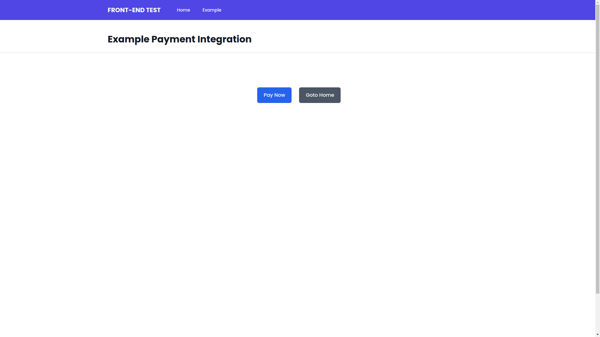
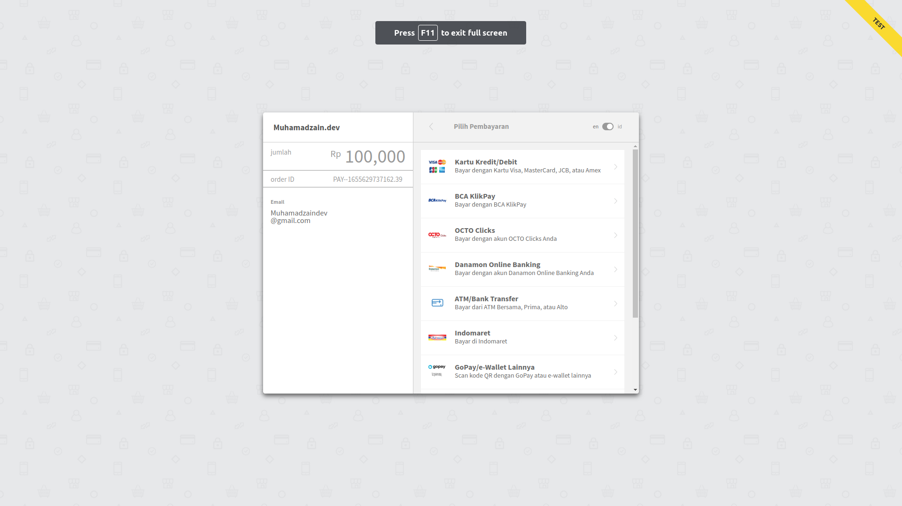

# Software Engineer technical Test (Front-end Side Test)

> Personal project for Software Engineer test.

## Stack used

- [Next.js](https://nextjs.org/)
- [Tailwind CSS](https://tailwindcss.com/)
- [TailwindUI](https://tailwindui.com/)
- [Midtrans Client](https://github.com/Midtrans/midtrans-nodejs-client)

## Developing

A Node.js LTS setup with [yarn](https://yarnpkg.com/) is recommended.

```bash
# install dependencies
yarn

# change environtment variable
cp .env.example to .env.local


BASE_URL=your_base_url
PRODUCTION_MODE=your_env_project
MIDTRANS_SERVER_KEY=your_server_key_midtrans
MIDTRANS_CLIENT_KEY=your_client_key_midtrans

# serve with hot reload at localhost:3000
yarn dev

```

## Result




## Credits

Built with. Created by [Muhamad Zainal Arifin](https://muhamadzain-dev.vercel.app/)
